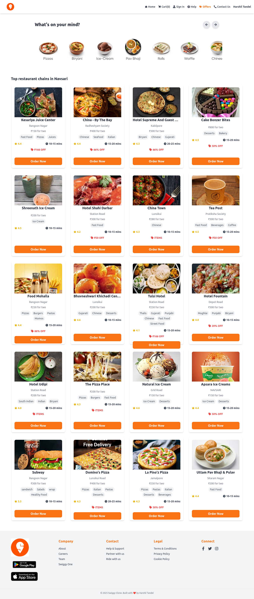

# 🛵 Swiggy Clone 🍽️

A beautiful & fully functional clone of Swiggy's food ordering app, built using **React.js**, **Tailwind CSS**, **Redux Toolkit**, and **React Router**.


---

## 🚀 Live Demo

👉 [Swiggy Clone Live](https://your-deployment-link.vercel.app)

---

## 📸 Screenshots

 🏠 Home 

|  |
---

## 🌟 Features

- 🔍 Search and filter restaurants  
- 🍽️ Restaurant details page  
- 🛒 Add to cart with Redux state management  
- 🧾 Checkout summary 
- 🎁 Offers section  
- 🧑 Sign In page (static)  
- ❓ Help and Contact pages  
- 📲 Fully responsive design  

---

## 🧰 Tech Stack

- **React.js**
- **Tailwind CSS**
- **React Router DOM v6**
- **Redux Toolkit**
- **Parcel Bundler**
- **Web3Forms** (for contact form)

---

## 🛠️ Getting Started

```bash
# 1. Clone the repository
git clone https://github.com/yourusername/swiggy-clone.git

# 2. Navigate to project directory
cd swiggy-clone

# 3. Install dependencies
npm install

# 4. Start the development server
npm start
```

## 🔮 Upcoming Features

-  Firebase OTP Login  
-  Real Swiggy API Integration  
- Order Tracking & History  
- Dark Mode Support  
-  Admin Dashboard Panel  
-  PWA Support for Mobile App Feel  

## 🙋‍♂️ Author

```txt
👨‍💻 Harshil Tandel  
Frontend Developer | React | MERN Stack  
📧 harshil.tndll@gmail.com  
🌐 Portfolio: https://harshil-tandel.netlify.app/
🔗 LinkedIn:https://www.linkedin.com/in/harshil-tandel-/
```

## 📜 License


This project is licensed under the [MIT License](LICENSE).

> 💡 This Swiggy Clone project is built purely for learning and demonstration purposes. It is not affiliated with the official Swiggy brand or its trademarks.

